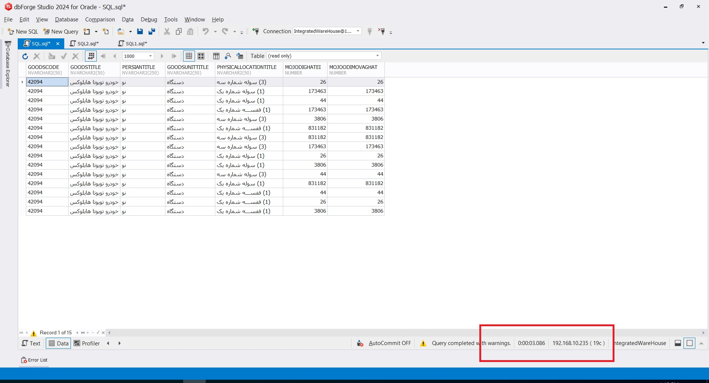

# Optimizing Query for Performance

## 1) Context
- Oracle Version/Edition: Oracle 19 
- Workload Type: OLTP
- Objects:  Table / Query / View / UDF
- Approx. Data Size: 800MB

---

## 2) Problem
- Symptom: long duration, excessive logical reads
- Baseline snapshot
  - Duration: 3.086s
  
- Example (Before Plan):

---

## 3) Investigation
This view was very large and heavy, so I started analyzing the query structure.
After my review, I found that part of the query used a subquery which returned around 3,600,000 rows, and for some columns of these rows it was calling UDFs (User Defined Functions).
I began to optimize and rewrite the query structure by removing all extra columns that were not needed in the final output, and I also removed or reduced the usage of UDFs as much as possible.

---

## 4) Results

---

## 5) Results
- Duration: 0.385s

---

## 6) Performance Comparison
| Metric        | Before       | After   | Improvement |
|---------------|-------------:|--------:|------------:|
| Duration      | 3.086 s      | 0.385 s | 87.5%       |

---

## 7) Change Applied
- Query rewriting
- Removing unused columns
- Eliminating or reducing the frequency of UDF usage

---

## 8) Scripts Used
| Original Script (Before Optimization)        | New Script (After Optimization)       |
|----------------------------------------------|--------------------------------------:|
| `./scripts/Query_OLD.sql`                    | `./scripts/QUERY_NEW.sql`             |

---

## 9) Risks & Rollback
- Risks: For each subquery or UDF review, the output before and after optimization had to remain exactly the same.
It was also important to make sure that the results did not change in any other scenarios.

